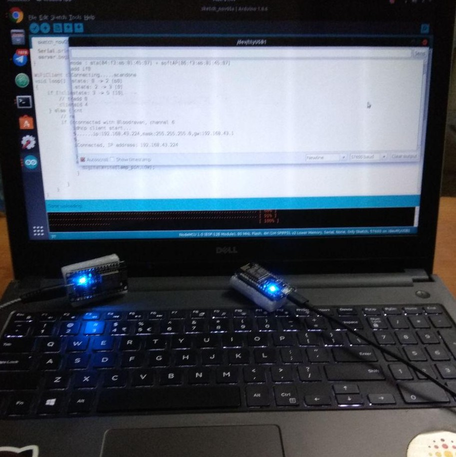
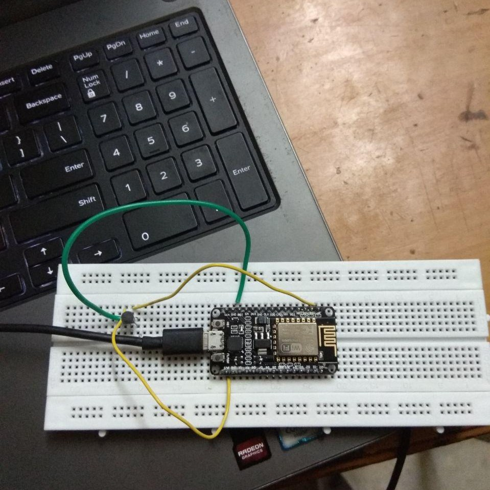
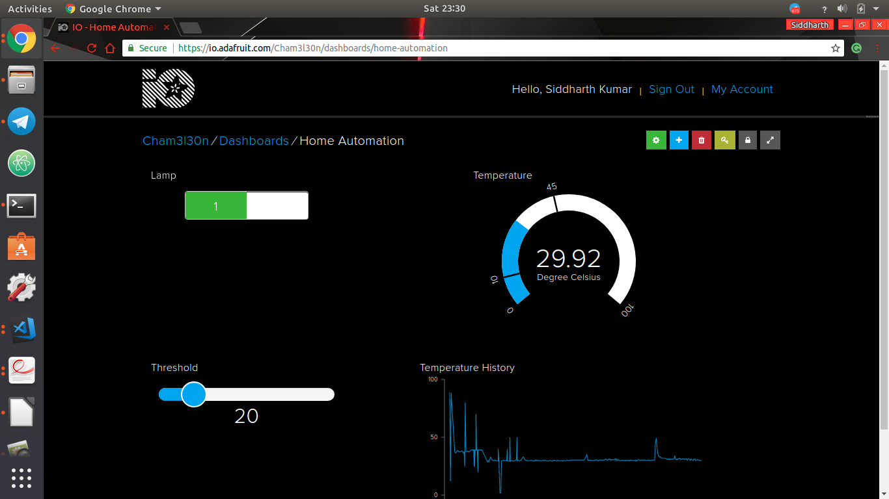

# Home-Appliance Automation
*Using esp8266 and MQTT protocol*

## Description of the project
This project is a trivial implementation of appliance automation using ESP8266 (NodeMCU 12E).

We use Google Assistant to send commands to the appliances remotely, and each ESP8266 that is connected to every electrical appliance is configured such that it responds to the request with appropriate data/operation. We will see the details of this communication in the later part of this section.

We also have a web interface actively working that can help check in real time if the devices are switched `ON` or `OFF`. This is the interface provided by the **Broker Server** that we are using for device communication.

Note that the Google Assistant can be configured to one or more devices for operating the appliances as per convenience, but we have configured only one device for the simplicity of explanation.

For illustration, we have used two basic electrical devices- Temperature Sensor and a CFL which we would control using the Assistant.

#### Abstract communication model
Consider the communication happening like this:
1. A person says a voice command remotely on their Google Assistant (available on any android phone) for a specific appliance that is present at their home (ex: switch off light-1).
2. Appropriate command(s)/data is sent to a server (a.k.a. broker server) that receives this data and processes it.
3. Server sends this data to a master board that is connected to a WiFi at their home.  
4. Master board sends this data to an appropriate device (to which the operation/data is intended).
5. The operation takes place after the data reaches it's location (ie. a board that is connected to the appliance the person wants to switch on/off)

Requirements for establishing communication:
+ Your phone should have an active internet connection
+ It should be configured to send request to the broker server
+ The master ESP board should be connected to a WiFi at home and should have internet access.
+ Slaves ESPs and master ESP should be connected to the same network.

#### Device Communication

Google Assistant API is used to send data from the mobile phone to the broker server.

We have used **MQTT Protocol** for device communication- it is a very simple and robust protocol that is used for IoT device communication.

> An analysis of the protocol was carried out during the development of this project and documented as a blog post which the reader can read here: [Playing around with MQTT Protocol](https://masterpessimistaa.wordpress.com/2018/11/04/mqtt-protocol/). The blog post contains all the details required to learn, analyse and implement MQTT protocol.

Each appliance is connected to an ESP8266 board and all these ESPs are in turn connected to a master ESP8266 board that drives these ESPs. We have implemented a master-slave model in this situation, where-in the master board receives data from the broker server (An entity in the MQTT protocol), and sends it to the ESP board to which it is intended to.

For communication between master-slave ESP8266 boards, we have implemented a Client-Server model: the master ESP8266 board acts as a Client to all other slave ESP8266 boards. Hence, the public IP address of each server is unique, which helps the master ESP8266 recognise to which device the data incoming from the *broker* server is intended to.

To send data, the master sends TCP packets to the required ESP8266 board (that is a slave).

After the required ESP8266 board receives data, it does the required operation. For example, an ESP8266 board connected to a CFL receives an `ON` command, then it simply switches the CFL ON with the help of a Relay that is connected to ESP board and the CFL.  
 |  | 

## What is the problem our project solves?
1. The appliances can be operated from any remote place, regardless of whether a person is in the same network or not.
2. The project solves the problem of manually checking if all the status of all the appliances,  
3. Because of the fact that MQTT Protocol is used for operating the devices, the reaction time of the request is dependent only on the speed of internet connnection of the configured mobile phone and WiFi connection to which the ESPs are connected.
4. MQTT is faster as compared to HTTP:
   + We noted that HTTP takes around 7 seconds to react, where as MQTT takes maximum of 3 seconds.
   + We have increased the efficiency of reaction by a factor of 2.33

## Who are the potential users of our system?
1. The project can help the people who are physically challenged to operate the devices using voice-command/web-interface.
2. It can be used by organisations who want to monitor the temperature of the server room remotely. They will get a notification in case the temperature crosses the threshold temperature
3. Common households

## Individual Contributions
1. Ashutosh Ahelleya
2. Siddharth Kumar
3. Tarunkant Gupta
4. Vignesh S Rao
